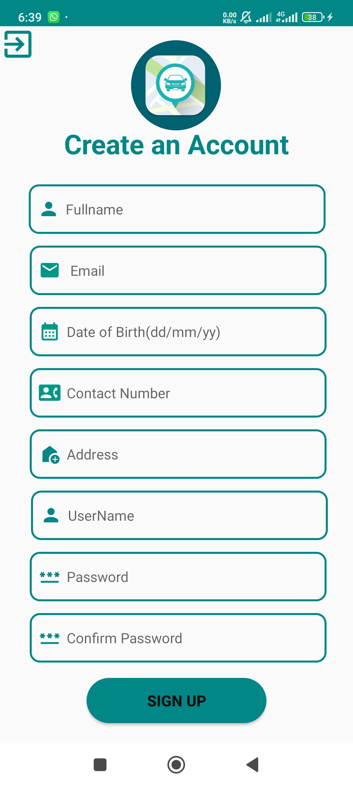
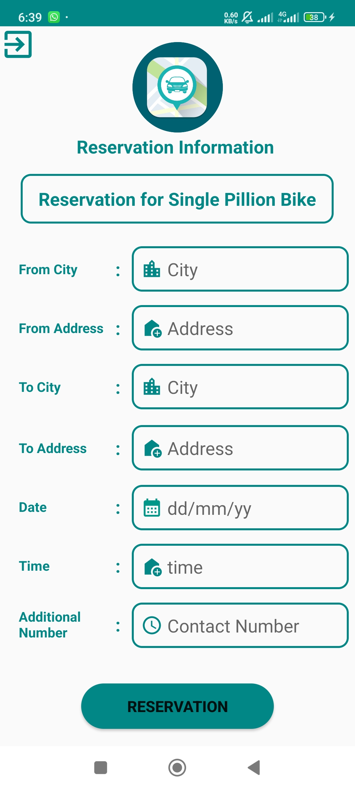
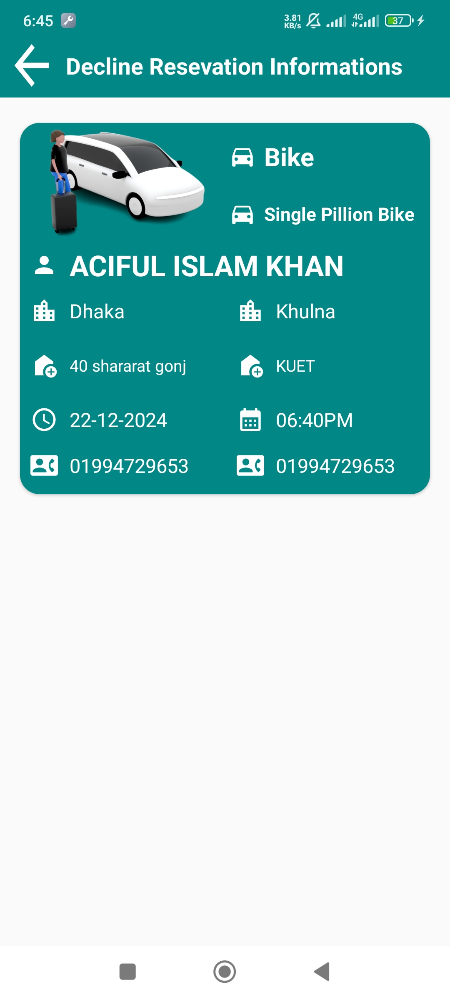

# Car Rental App

## Project Description and Overview

The Car Rental App is a feature-rich mobile application developed using Android Studio and Firebase. This app allows users to rent a variety of vehicles for inter-city and outer-city travel, providing a seamless and user-friendly experience. The application features a high-quality UI design with intuitive navigation, ensuring ease of use for users of all backgrounds.

### Key Features

1. **User Authentication**
   - Secure sign-up and login functionality.
   - Password recovery ("Forgot Password") for seamless account recovery.

2. **User Information Management**
   - Personal information storage and management.
   - User profile section to view and update details.

3. **Reservation System**
   - Easy booking for vehicles with reservation records.
   - Sections for **Accepted Reservations**, **Declined Reservations**, and pending requests.

4. **Navigation Drawer**
   - A user-friendly navigation drawer for quick access to app features.

5. **Firebase Integration**
   - Firebase Authentication for secure user verification.
   - Firebase Realtime Database for storing user information, reservations, and vehicle details.

### Technologies Used

- **Frontend**: Android Studio (Java/Kotlin)
- **Backend**: Firebase Authentication, Firebase Realtime Database
- **UI/UX**: High-quality material design principles for an engaging user experience

### Use Cases

- Users can hire vehicles for personal or business use, choosing between inter-city or outer-city trips.
- Users can view and manage their reservation records, track accepted or declined requests, and receive updates.

## Installation

Clone this repository to your local machine:

```bash
git clone https://github.com/Elin-powS/Car_Rental_App.git
```

### Open the Project in Android Studio

1. Configure Firebase:
   - Add the `google-services.json` file to your project.
   - Set up Firebase Authentication and Realtime Database in your Firebase console.
2. Build and run the application on an emulator or physical device.

## Prerequisites

- Android Studio installed on your machine.
- Firebase project with Authentication and Realtime Database enabled.

## How to Use

### Sign Up or Log In:
- Create a new account or log in using your existing credentials.

### Browse Vehicles:
- Choose the type of vehicle you want to rent for inter-city or outer-city travel.

### Make a Reservation:
- Book your desired vehicle and check the reservation status in the app.

### Manage Your Profile:
- Update your personal information in the profile section.

## Screenshots

<div style="display: flex; flex-wrap: wrap; gap: 10px;">
  
  
  
  
  
  
  
  
  
    
  
   
  
  
  
   
   
  
</div>

## Future Enhancements

- Add payment gateway integration for online payments.
- Implement push notifications for reservation updates.
- Introduce vehicle tracking using GPS.

## License

This project is licensed under the MIT License - see the LICENSE file for details.

## Contact

For any queries or contributions, please contact:

**Developer:** Aciful Islam Khan   
**Email:** sopnil493@gmail.com 
**GitHub:**  https://github.com/Elin-powS

Thank you for using the Car Rental App! Enjoy a seamless vehicle booking experience.
